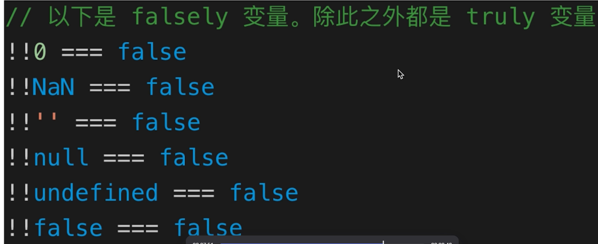
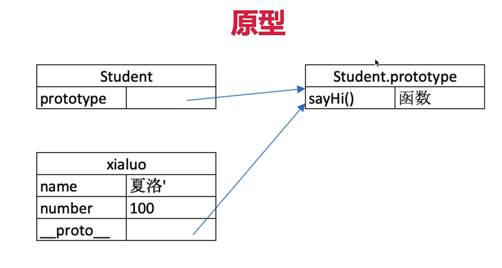
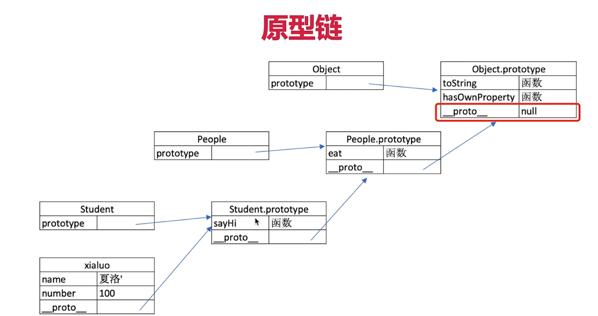
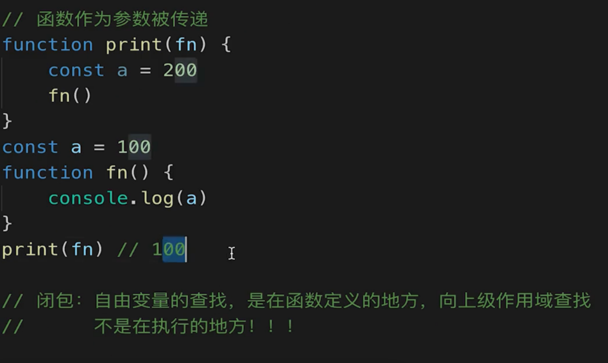
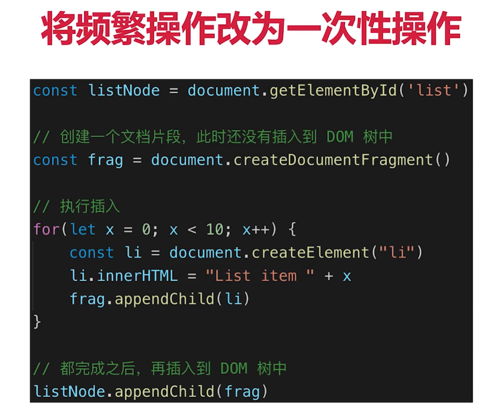
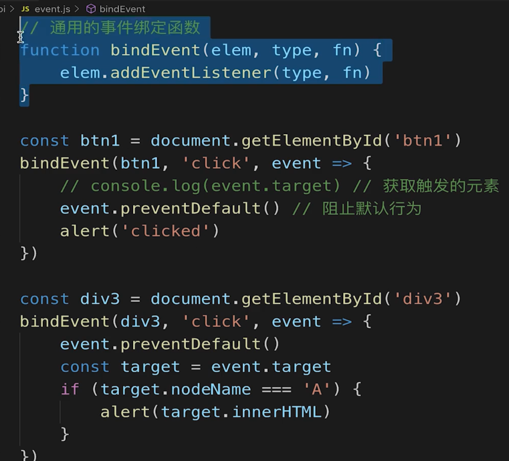
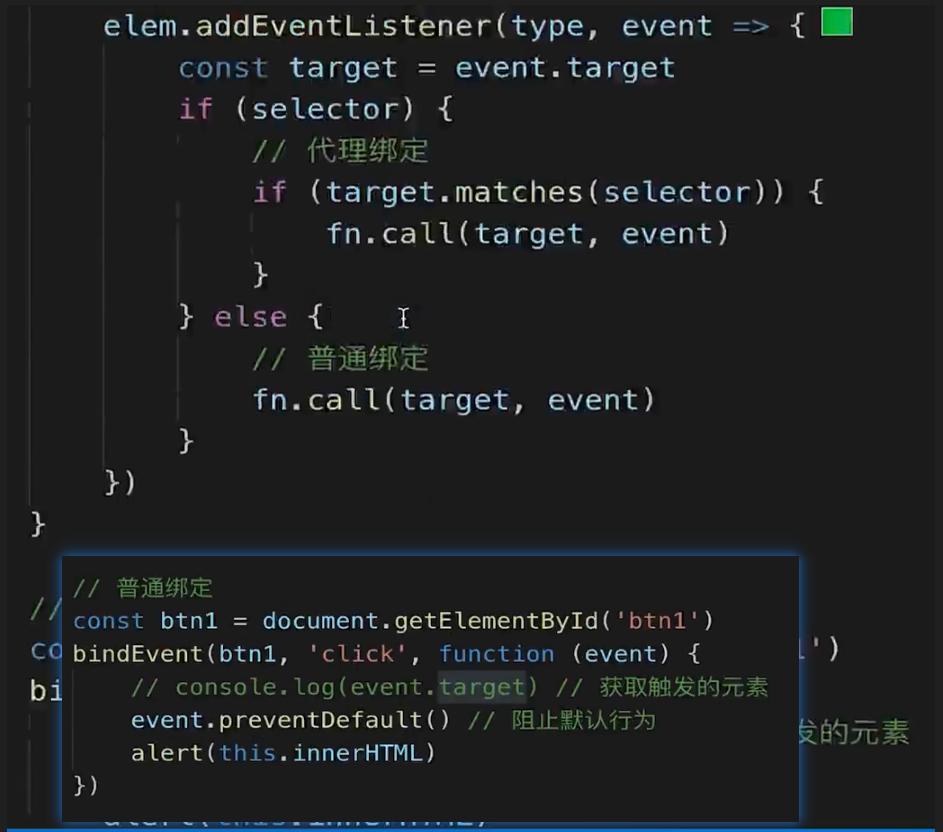
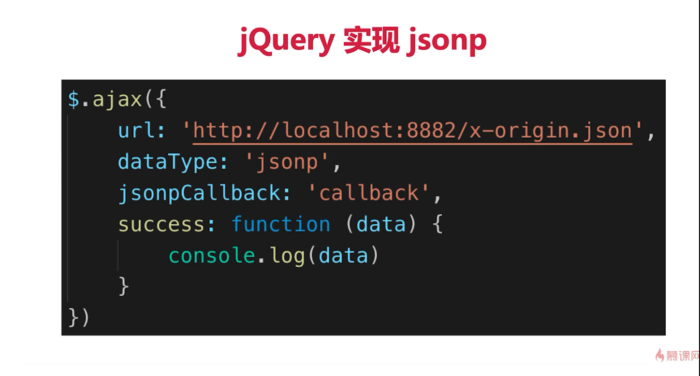
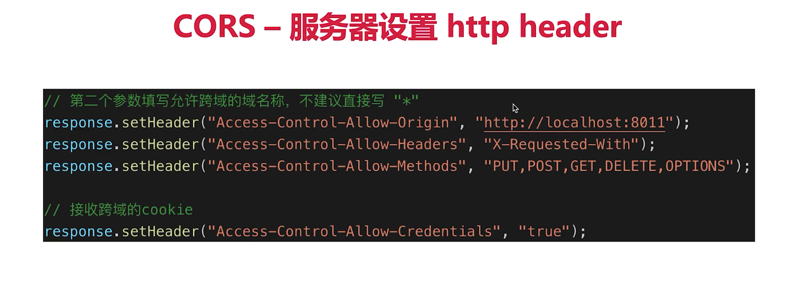
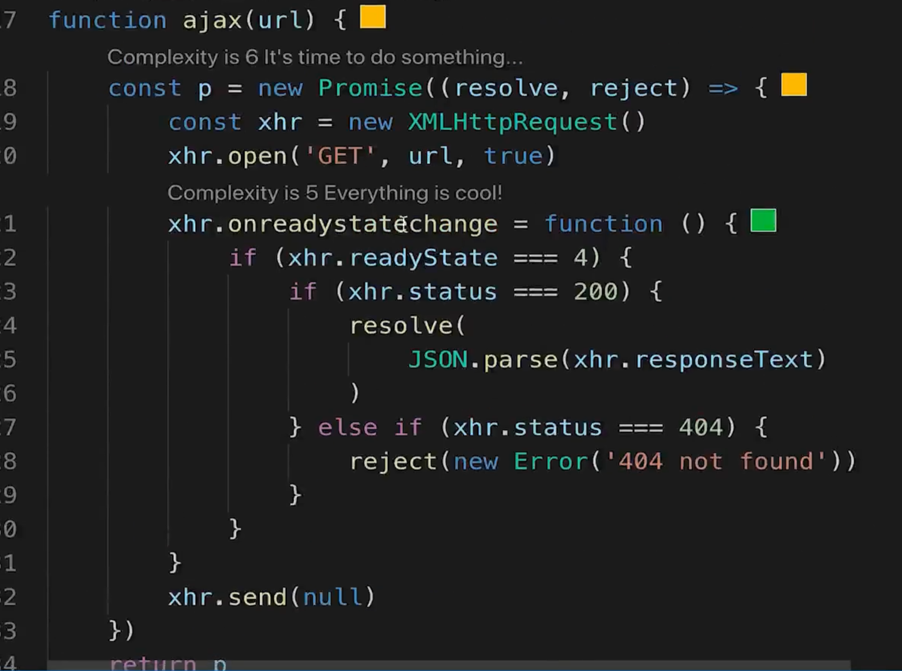

## js知识点

#### 1.常见的值和引用类型

值：

1. undefine
2. 字符串
3. 数值
4. bool
5. symbol

引用：

1. 对象
2. 数组
3. null


#### 2.深拷贝与浅拷贝

对于一种问题，比如对象的引用

let obj1 = obj2

obj1.name = "aa"

那么，obj2的name也会因此改变，这就是浅拷贝

这两个对象实例都是指向的同一块内存空间，如果是深拷贝的话，就不会出现这种问题。深拷贝就相当于是把原对象通过递归的方式，将原对象原原本本的复制过去。这样，这个对象实例就变成了一个独立的个体，有着自己的内存空间。

```js
function deepClone(obj={}){
  if(typeof obj !== 'object' || obj == null){
    // 如果传入的不是对象或者为空的话，那么就给他按原值返回
    //因为后面需要递归进行调用，如果遇到值，就可以直接进行赋值
    //如果是对象的话，还是需要继续递归调用，直到找到值为止
    //为了防止出现对象套对象的情况，这样就可以一次性的把对象给遍历完
    return obj;

  }
  let result 
  if(obj instanceof Array){
    result = []
  }else{
    result = {}
  }

  for(let key in obj){
    // 保证key不是原型的属性
    if(obj.hasOwnProperty(key)){

      // 不停的递归，直到找到值为止，只要是对象或者数组，就会一直递归
      result[key] = deepClone(obj[key])
    }
  }
}
```

上述代码为深拷贝，主要的内容就是对对象中的对象进行递归遍历


#### 3.parseInt

字符串转数字：parseInt

如果遇到字符串拼接问题

`return 100+"10"`返回的就是一个字符串

如果想要返回纯数字，那么就需要`return 100+parseInt("10")`


#### 4.什么时候用== 和===

大部分情况下都可以用===

只有在判断空的时候可以用==

因为==会做一个强制的类型转换，可能会得到错误的结果


#### 5.truly和falsely变量



```js
!!0 === false
!!NaN === false
!!'' === false
!!null ===false
!!undefined === false
!!false = false
```

只要两次取反结果为true的变量就是truly变量

==if语句（）中判断的就是truely变量和falsely变量==

==逻辑判断同理==


#### 6.instanceof类型判断

从字面意思可以看出，instanceof就是看前者是不是后者的一个实例

instanceof会根据原型链一层一层的往上找，如果找到了就会返回一个true

#### 7.隐式原型和显式原型



`__proto__`是隐式原型`prototype`是显式原型

#### 8.原型链



对于原型链，我是这么理解的：

xialuo作为student类的一个实例，他的隐式原型就指向student的显示原型，而Student类继承于父类People，所以student也有一个隐式原型去指向父类people的显示原型


#### 9.手写jQuery

```js
class jQuery {
  constructor(selector){
    const result = document.querySelector(selector)
    const length = result.lenth;
    for(let i = 0; i < length; i++){
      this[i] = result[i]
    }
    this.length = length;
    this.selector = selector
  }
  get(index){
    return this[index]
  }
  each(fn){
    for(let i = 0; i < this.length; i++){
      const elem = this[i];
      fn(elem)
    }
  }
  on(type,fn){
    return this.each(elem =>{
      elem.addEventListener(type,fn,false)
    })
  }
}
```

其中each()中的fn就是回调函数


#### 10.闭包



对于闭包，对自由变量的查找，是从函数定义的地方开始的，然后向上级作用域一层一层的查找，直到window，而不是在执行的地方

#### 11.property和attribute


尽量使用property，这个引起dom渲染的可能性较小


#### 12.转化为数组


`Array.prototype.slice.call(转化对象)`


#### 13.dom操作性能优化



通过createDocumentFragment()，创建一个文档片段，插入到文档片段的dom元素并不会立即被渲染，会在后续appendChild中统一渲染


#### 14.事件代理（基于冒泡）



由于事件的冒泡行为，事件会向上进行传递




#### 15.跨域问题

1.jsonp方式

因为`script`是可以跨域的，所以，可以通过`script`便签去请求网址，通过这个去传数据

另外也可以通过ajax传递



2.CORS通过服务器进行设置

通过服务端设置可信任的端口或者域名


#### 16.手写ajax



```js
function ajax(url){
  const p = new Promise((resolve,reject)=>{
    const xhr = new XMLHttpRequest();
    xhr.open("GET",url,true);
    xhr.onreadystatechange = function(){
      if(xhr.readyState ===4){
        if(xhr.status === 200){
          resolve(
            JSON.parse(xhr.responseText)
          )
        }else if(xhr.status ===404){
          reject(new Error('404 not found'))
        }
      }
    }
    xhr.send(null)
  })
  return p;
}
```

#### 17.本地存储cookie,localstorage,sessionstorage

不同点：

设置值不同

cookie:通过`document.cookie=''`设置，并且不会覆盖，会类似于push的方式跟在后面，最大存储4k，每次向服务器发送请求都会跟着进去。

localStorage和sessionStorage:

从字面意思就可以看出，sessionStorage是只存在于本次会话，当浏览器关闭时，就会消失。

而localStorage可以存储在本地

这两个最大可以存储5M，通过`setItem`设置，`getItem`获取

并且不会随着http请求发送出去

综上，一般用localStorage比较多

#### 18.手写防抖

防抖就是防止一个事件多次被触发，比如输入事件，按下键，的事件会被不停的触发，所以需要做出防抖，比如延时一段时间后才去执行某个函数

```js
function debounce(fn,delay = 500){
  let timer = null;
  return function (){
    if(timer){
      clearTimeout(timer)
    }
    timer = setTimeout(() => {
      fn.apply(this,arguments)
      timer = null
    }, delay);
  }
}
```

#### 19.手写节流

对于类似拖拽事件，会触发很多事件，这时候就可以使用节流，每隔一段时间触发一次，而不是每动一下就触发一次，这样体感感觉不到，而且性能也有提升