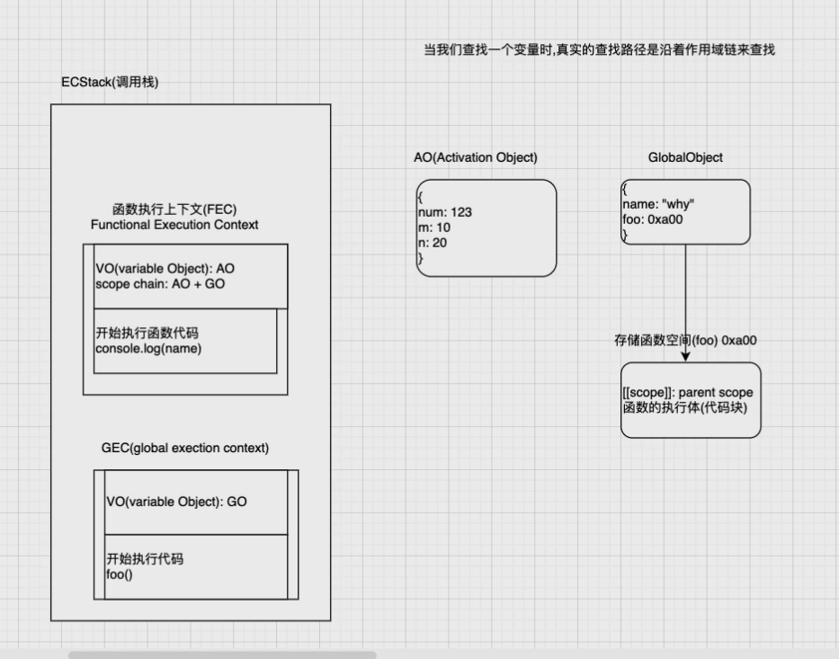

## js高级语法

#### 1.v8引擎

js代码的解析过程：

首先是将js文件下载下来，接着就是通过js引擎对js进行解析

1. 将js代码进行词法分析，分析成一个类似数组的tokens，里面存放了各种的对象类似json对象，其中会有例如{type:"keyword",value'name'}之类的，将关键字与变量名和变量值分割
2. 接着就是语法分析，这个过程会生成一个AST抽象语法分析树
3. 语法分析树通过Ignitition（这是一个库），将语法分析树转化为字节码
4. 然后将字节码转化为cpu可以识别的机器码，在这个过程中会对部分高频率运行的一些函数进行优化，比如重复的操作会直接转化为机器码，而不会去重新转换，但是如果突然参数类型发生改变，则会发生反向转换，再将操作转化为字节码，然后再次汇编成机器语言。

#### 2.js代码运行前的解析

在解析过程中，会生成一个全局对象globalObject，这个对象中会有各种对象，比如math对象，date对象，number对象，setTimeout，还有window，其中window是指向globalobj的，指向自己，相当于this。

在解析过程中，var与函数声明会进行作用域提升，提前进行声明，成为GlobalObject的一个属性，但是还是没有赋值，所以都是undefine

#### 3.执行代码

在执行代码的时候，为了使全局代码能够正常运行，所以创建了一个全局上下文(Golbal Execution Context )，接着会将全局对象放入，接着，代码就会顺序执行，将之前定义但是还没有赋值的变量进行赋值

 

在遇到函数的时候，会创建一个函数执行上下文，同时创建一个ao对象，将变量的声明会放到ao中，在函数执行结束后，ao会被销毁，然后将函数执行上下文弹出

#### 4.js内存管理

当你对一个变量进行声明的时候，js就会自动为你分配一个内存

#### 5.高阶函数

把一个函数如果接受另外一个函数作为参数，或者该函数会返回另一个函数作为返回值的函数，那么这个函数就称为是一个高阶函数

#### 6.数组方法(高阶函数)

find()查找并返回item

findIndex()查找返回下标index

filter()

map()

forEach()

reduce()查找

#### 7.闭包

闭包是由两部分组成的：函数+可以访问到的外部自由变量