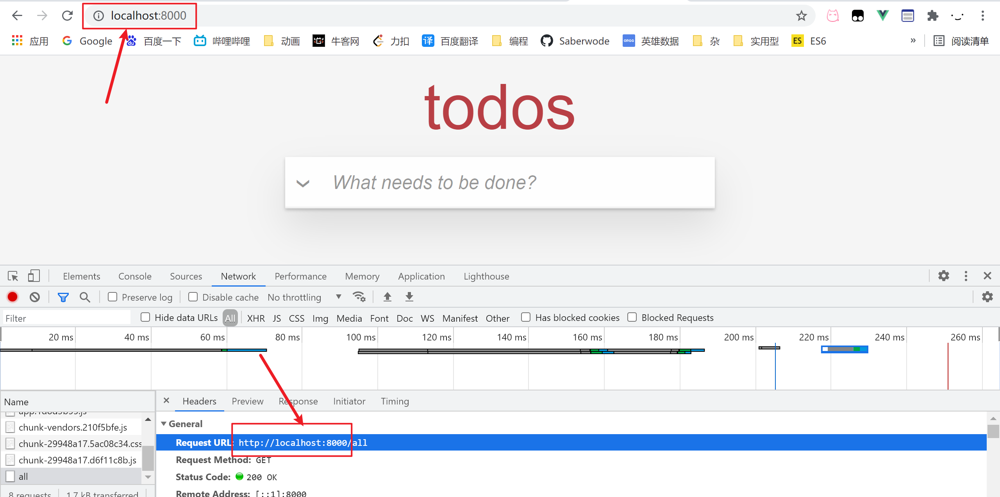

## 前后端交互问题

> #### 前景提示：前后端交互我踩了好多的坑，可能有自己错误的理解以后发现了会来更正（大概）

#### 1.拷贝dist目录没有变化问题

利用express骨架生成的代码是这样的

```js
app.use(express.static(path.join(__dirname, 'public')));
```

按理说这个是根据文件夹的名字去找public中的资源，但是我的并不行

所以，我尝试了另一种方式，将文件路径给写死（要是这样也不行我是真的没辙了）

```js
app.use(express.static('./public/dist'))
```

然后页面就成功显示了

dist目录来源：前端的文件输入`npm run build`进行打包就会出现dist目录

#### 2.前端向服务器发送请求

这个问题是，前端向服务器发送请求

个人猜测，如果vue通过localhost发送请求的话，默认是通过vue前端启动项目的端口进行发送请求的

比如你用vue-cli默认端口8080也就是`localhost:8080`，去请求本地服务器的地址是`localhost:3000`的话，

是行不通的



就算你在项目中设置请求3000端口，例如：

```js
const res = await axios.get('http://localhost:3000/all')
```

但是你的vue启动的端口是在8000，他就会自动去请求8000，你设置的3000压根就没用。。

#### **下面是解决办法**

因为这一特性，所以vue项目启动必须跟后端如果是本地的话，必须在同一个端口中，但是如果设置为同一个端口的话，就会互相冲突，所以需要将==vue项目部署到服务器中==，这样，他们就会在同一个端口共存

#### 3.axios请求为object问题

错误版本：

```js
const res = await axios.get({
        url:"/all"
      })
```

错误的信息是：


我把代码重新改了改，因为发现他后面跟的是一个对象，我就想到，是不是get请求后面{}的问题，我就将它改成了字符串

```js
const res = await axios.get('/all')
```

然后一切就正常了。。