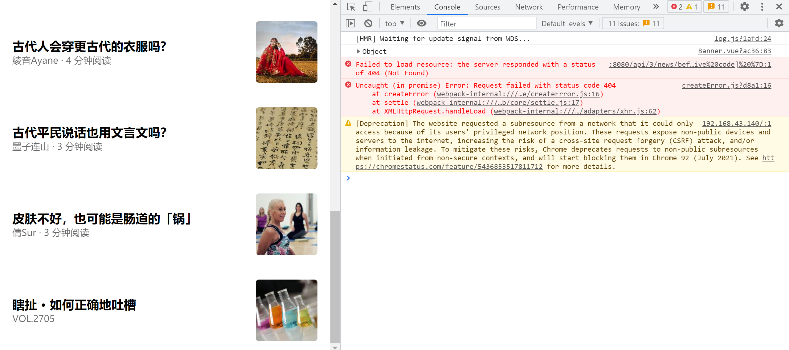
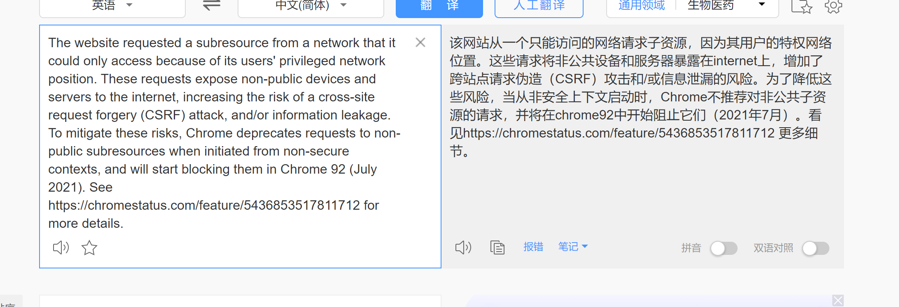
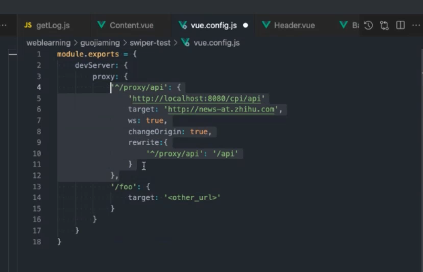

实现思路：

从上到下：

#### 1.header:

三部分：logo，app下载，浏览内容

#### 2.download：

- 1.背景为蓝色
- 2.左边的img左移动画（两端对齐）

- 3.右边的div下移动画
  - 上部：
    - 标题
    - 内容
  - 左下部
    - 二维码
  - 右下部
    - 上方ios下载
    - 下方Android下载

#### 3.浏览内容（main-content）

- 1.head
- 2.内容分为三列

#### 4.尾部（footer）

- 1.左部文字
- 2.右部二维码


#### 5.页面详情

- 1.首先需要在


```
<div class="before" v-for="item in beforeStories" :key="item.id">
      <content-item
        :imgUrl="item.images"
        :title="item.title"
        :hint="item.hint"
      ></content-item>
      <!-- </div> -->
    </div>
```

```
<div class="before" v-for="item in beforeData" :key="item.id">
      <!-- <button @click="click(item, index)"></button> -->
      <el-divider content-position="left">
        <content-item
          :imgUrl="item.stories[0].images"
          :title="item.title"
          :hint="item.hint"
        ></content-item>
      </el-divider>
    </div>
```






## 项目改进

#### 1.模板字符串：

```js
return `${month}月${day}日`;
```

利用mustach语法

#### 2.async函数：

```js
async created() {
    const res = await axios({
      url: "/api/3/stories/latest",
    });
    if (res?.data?.stories) {
      this.stories = res.data.stories;
      this.date = res.data.date;
    }
    // axios({
    //   url: "/api/3/stories/latest",
    // }).then((res) => {
    //   this.stories = res.data.stories;
    //   this.date = res.data.date;
    // });
  },
```

利用`async`函数，可以将很难看的异步操作，变为好看的类似同步操作的异步操作。。看着像同步实则不是

#### 3.CLI-service配置：



可以用rewrite方法重写，方便修改